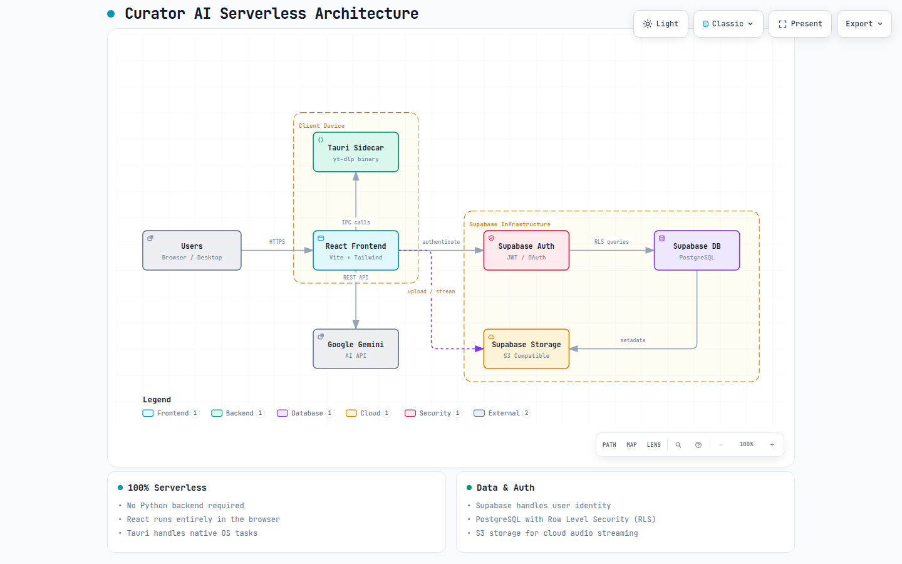

# Curator AI 🎵📚

Transform any topic, artist, or vibe into a structured learning path or a curated music mix in seconds. Curator AI is a **100% serverless, cloud-first application** that sits at the intersection of AI generation, cloud-synced media, and direct-to-device downloading.

## 🌐 Live Application
Try the live web app directly: **[https://curator.foodzie.store](http://curator.foodzie.store)**

## 🚀 Direct Downloads
You can download the native apps directly from the live website or via the links below:

| Platform | Installer Type | Download Link |
|:---|:---|:---|
| 🤖 **Android** | `.apk` | [Download CuratorAI.apk](http://curator.foodzie.store/downloads/CuratorAI.apk) |
| 💻 **Desktop (Linux/Mac/Win)** | `.AppImage` (zipped) | [Download CuratorAI-Desktop.zip](http://curator.foodzie.store/downloads/CuratorAI-Desktop.zip) |

## ✨ Features
- **Serverless Architecture:** Completely decoupled from the legacy Python backend. Uses Supabase directly for authentication, history, caching, and media storage.
- **Personal Cloud Library:** A script is provided (`scripts/upload_music_to_cloud.py`) to easily upload your local MP3s directly to your Supabase storage, with automatic ID3 duration/metadata extraction via `mutagen`.
- **Intelligent Querying:** The app intercepts searches to prioritize your Cloud Library tracks instantly before falling back to the Gemini/Groq APIs.
- **Global Caching:** If someone else has already searched your topic via the AI APIs, you get the structured roadmap instantly with 0 latency.
- **Bring Your Own API Key:** Uses your personal Gemini or Groq keys for completely free, unlimited AI generations.

## 🛠️ Developer Setup (Run from Source)

If you want to edit the code and run the app locally:

```bash
# 1. Clone the repository
git clone https://github.com/Jaspreet-Bhatia-AI/CuratorAI.git
cd CuratorAI

# 2. Setup Frontend
cd frontend
npm install

# 3. Start Web Environment
npm run dev

# 4. Build Desktop App (Tauri)
npm run tauri build

# 5. Build Android App (Capacitor)
npx cap sync android
cd android && ./gradlew assembleDebug
```

### Architecture

<picture>
  <source media="(prefers-color-scheme: dark)" srcset="docs/architecture/curator-architecture.visual-check.1440x900.dark.png">
  <source media="(prefers-color-scheme: light)" srcset="docs/architecture/curator-architecture.visual-check.1440x900.light.png">
  
</picture>

*(For an interactive, animated version of this map, download and open [`docs/architecture/curator-architecture.html`](docs/architecture/curator-architecture.html) in your browser).*
- **Frontend UI:** React + Vite + TailwindCSS (Material 3 Design)
- **Mobile Wrapper:** Capacitor (Android/iOS)
- **Desktop Wrapper:** Tauri (Rust)
- **Database/Auth/Storage:** Supabase (PostgreSQL)
- **AI Integrations:** Gemini & Groq APIs
